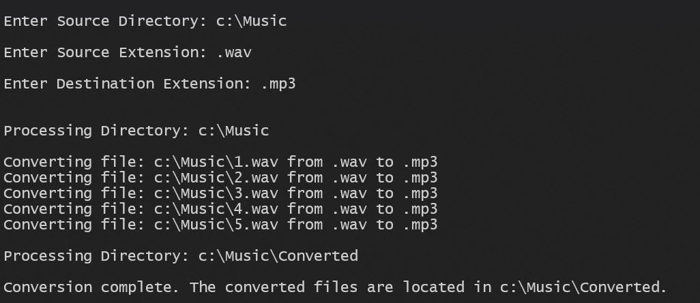

# audio-converter

This application recursively retrieves audio files from the specified source directory and converts them between different formats. [FFmpeg](https://ffmpeg.org/) was used to convert the files.



## Installation Instructions

1. Clone the repo:
```sh
git clone https://github.com/xiraynedev/audio-converter.git
```

2. Change directory:
```sh
cd audio-converter
```

3. Open the solution file in **Visual Studio 2022**. Be sure to already have FFmpeg installed on your system at the location `C:\Tools\ffmpeg\bin\ffmpeg.exe`.